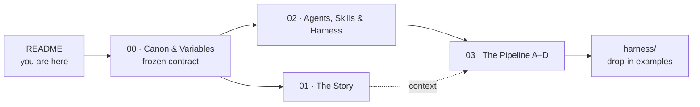

# Agentic Engineering on GitHub

A reusable, **white-label** asset that shows how to run a real software-delivery pipeline on
GitHub with AI agents working in **fleet mode** (many agents in parallel), under a strict
**Plan → Validate → Execute** discipline — with humans in control at the points that matter.

> 🧭 **What this is / isn't.** A presenter-led narrative + reference harness for engineering leaders
> and senior developers evaluating adoption. **Not** a slide deck and **not** a hands-on lab. Every
> client-specific detail lives behind a variable or inside a clearly-marked call-out, so you can
> re-skin it for any company without rewriting the substance.

---

## Read in this order

| # | Document | What it gives you |
|---|---|---|
| 00 | [Canon & Variables](./00-canon-and-variables.md) | The **frozen contract**: shared vocabulary, the white-label variable schema, the agent roster, the pipeline phases, and the four rules every other doc obeys (native-vs-layered, enforcement-boundary, traceability, hygiene). Read first. |
| 01 | [The Story](./01-story.md) | The executive narrative — why the *factory* (not the feature) is the product, and how an orchestrator runs a fleet safely. |
| 02 | [Agents, Skills & the Harness](./02-agents-skills-harness.md) | The **Harness Configuration Map**, the 8-role reference roster, three design notes, and the enforcement-boundary map. |
| 03 | [The GitHub-Powered Pipeline](./03-github-pipeline.md) | The factory in motion: phases **A–D**, fleet orchestration & failure handling, governance & traceability, verification, a maturity roadmap, economics, and honest limitations. |
| — | [`harness/`](../../harness/) | Deliverable 2 **made real** — the reusable template: `AGENTS.md`, agent personas, prompt files, skills, runnable check logic (`checks/`), Actions workflows, and an issue form. See its [README](../../harness/README.md) first. |
| ▶ | self-test rig (local-only) | The harness **made runnable** — a deterministic backbone that *executes* this pipeline offline (sample app + dispatcher + a 74-fixture gate matrix where every gate catches its seeded failure). Kept in the gitignored `_internal/harness-selftest/` so the published template stays lean; run `node _internal/harness-selftest/validate/run.mjs`. |

---

## How to re-skin it for a client

The asset is driven by variables defined in **[00 · Canon & Variables, §2](./00-canon-and-variables.md#2-white-label-variable-schema)**.
To re-pitch, set them — everything else stays as written:

| Variable | Set to |
|---|---|
| `{{CLIENT}}` / `{{DOMAIN}}` | The client and their industry |
| `{{ASSURANCE}}` | `standard`, or `high-assurance/regulated` (turns on the **🔒** call-outs) |
| `{{DEMO_APP}}` | A small but realistic service the agents build end-to-end |
| `{{DEPLOY_TARGET}}` | The target test environment |
| `{{SECURITY_QA_TOPOLOGY}}` | Whether Security/QA is combined or split out |
| `{{FLEET_CONCURRENCY}}` | Max agents running in parallel |
| `{{AUDIENCE}}` | Who the pitch is for |

Locked demo defaults (the example app, the concurrency cap, the deploy target) appear **only** as
defaults in `00` and inside call-out blocks — never baked into the generic prose.

---

## The honesty legend (used throughout)

This asset is deliberate about what GitHub *ships* vs. what you *build on top*:

| Label | Meaning | Examples |
|---|---|---|
| 🟩 **Native** | A real GitHub product/primitive that can **enforce**. | Rulesets, required status checks, required reviews, CODEOWNERS, Environments, merge queue, Actions, sub-issues, Copilot coding agent, GHAS scans |
| 🟦 **Layered pattern** | A practice you implement **on** the platform — **not** a GitHub product. | Evals (trajectory / LM-judge / rubric), agent-to-agent (A2A) handoff |
| 🟨 **Integration / context** | Informs the agents but does **not** enforce by itself. | MCP tool exposure, Copilot Spaces, Copilot code review (advisory) |

> ⚠️ **Files don't enforce governance — configuration does.** The `harness/` examples shape agent
> *behavior*; what actually **stops a bad change** is required checks + rulesets + required reviews +
> Environments + merge queue configured in the target repo. See
> [`03` Governance & traceability](./03-github-pipeline.md#subsection-2--governance--traceability)
> and [`harness/README`](./harness/README.md).
